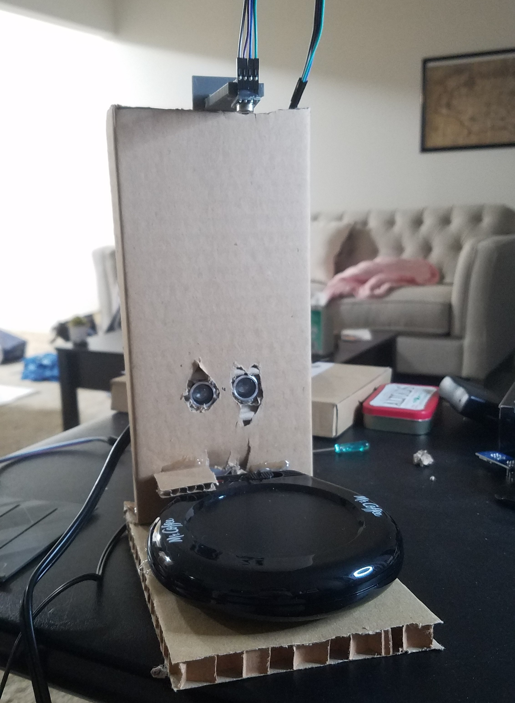
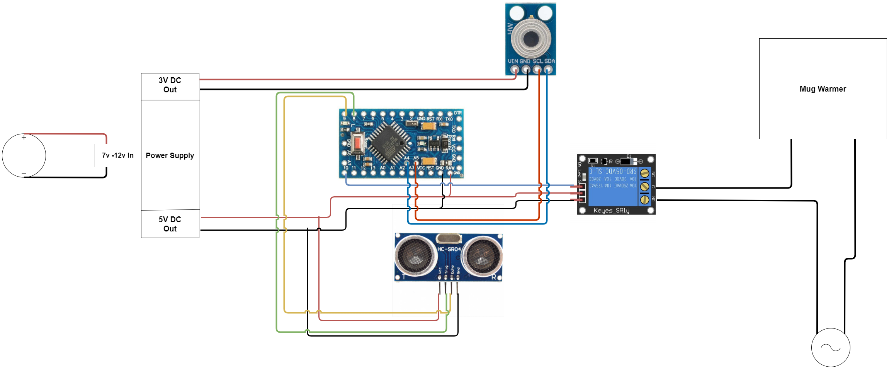

# Smart-Mug-Warmer
C program that will run my Arduino smart mug warmer

### Why  
I wanted to learn to use arduino and an embedded project seemed like a fun project to try.  
I (someone who drinks a lot of coffee) thought this would be useful.
Obviously this isn't meant to last forever, its mostly made of cardboard. But it gave me a chance to use 3d printed parts
in a project.

## Wiring

