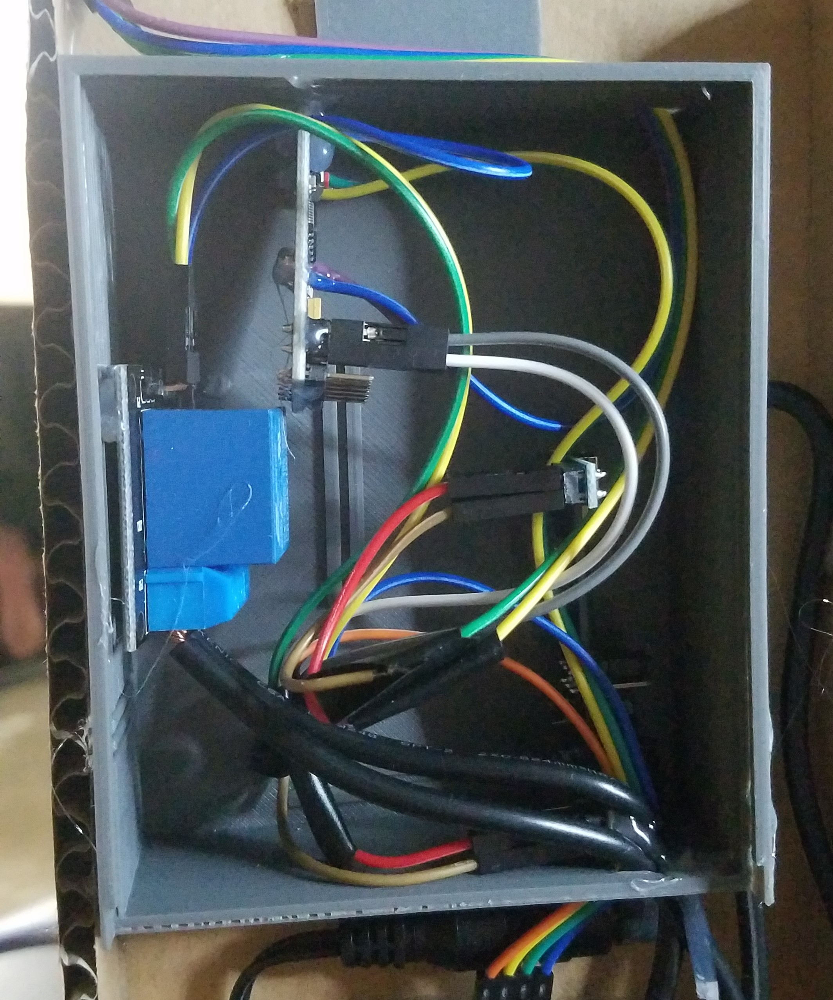

# Smart-Mug-Warmer
A "smart" mug warmer, that detects presence of a mug, and its tempurature.  
Powered by C, on an arduino pro-mini.  
  
## How  
Power to the mug warmer is controlled via a relay in the control box on the back of the cardboard. The relay is controlled by
an arduino pro-mini. The arduio will allow the mug warmer to turn on if it detects a mug (using the ultrasonic sensor) and if 
it detects that the coffee in the mug is too cold (using the infrared thermometer).

## Why  
I wanted to learn to use arduino and an embedded project seemed like a fun project to try.  
I (someone who drinks a lot of coffee) thought this would be useful for my daily life.
Obviously this isn't meant to last forever, its mostly made of cardboard. But it gave me a chance to use 3d printed parts
in a project.

## Wiring

  

If you are interested in building something similar, the stand-off I made for the ultrasonic sensor can be found here on Thingiverse:  
https://www.thingiverse.com/thing:4086316
